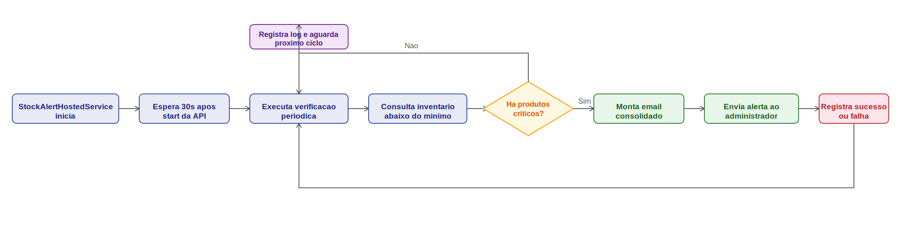

# 🛒 Ambev Developer Evaluation — Backend Challenge

> API REST para gestão de vendas com processamento assíncrono, desenvolvida em **.NET 8** seguindo **Clean Architecture**, **CQRS** e princípios de **DDD**.

---

## 🗂️ Índice

- [Visão Geral](#-visão-geral)
- [Stack e Tecnologias](#-stack-e-tecnologias)
- [Arquitetura](#-arquitetura)
- [Como Rodar](#-como-rodar)
- [Recursos Disponíveis](#-recursos-disponíveis)
- [Usuários Pré-cadastrados](#-usuários-pré-cadastrados)
- [Endpoints Principais](#-endpoints-principais)
- [Regras de Negócio](#-regras-de-negócio)
- [Fluxo de cancelamento ou deleção da venda](#-fluxo-de-cancelamento-ou-deleção-da-venda)
- [Testes](#-testes)
- [Decisões Técnicas](#-decisões-técnicas)
- [Melhorias Futuras](#-melhorias-futuras)

---

## 🎯 Visão Geral

API REST para gerenciamento de vendas com foco em clareza de domínio e boas práticas de arquitetura. Oferece criação, consulta, atualização e cancelamento de vendas com **cálculo automático de descontos por quantidade**. A criação e atualização de vendas são processadas de forma **assíncrona via RabbitMQ**, retornando um `correlationId` para rastreamento. Inclui gestão de catálogo (produtos, categorias, inventário), clientes, filiais e carrinhos de compra.

---

## 🧰 Stack e Tecnologias

### Core

| Tecnologia | Versão | Uso |
|---|---|---|
| .NET | 8.0 | Runtime e SDK |
| ASP.NET Web API | 8.0 | Camada HTTP |
| Entity Framework Core | 8.0.11 | ORM e Migrations |
| Npgsql EF Core | 8.0.8 | Provider PostgreSQL |
| PostgreSQL | 16 | Banco de dados relacional |
| RabbitMQ | 3.13 | Mensageria assíncrona |

### Application

| Pacote | Versão | Uso |
|---|---|---|
| MediatR | 12.4.1 | CQRS / Mediator |
| AutoMapper | 16.1.1 | Mapeamento de objetos |
| FluentValidation | 11.10.0 | Validação de comandos e requests |
| BCrypt.Net-Next | 4.0.3 | Hash de senhas |
| OneOf | 3.0.271 | Union types para resultados |

### Observabilidade

| Pacote | Versão | Uso |
|---|---|---|
| Serilog.AspNetCore | 8.0.3 | Logging estruturado |
| Serilog.Exceptions | 8.4.0 | Enriquecimento de exceções |
| Serilog.Formatting.Compact | 3.0.0 | Formato JSON compacto |
| AspNetCore.HealthChecks.Rabbitmq | 9.0.0 | Health check RabbitMQ |
| AspNetCore.HealthChecks.UI | 9.0.0 | Dashboard de saúde |

### API & Docs

| Pacote | Versão | Uso |
|---|---|---|
| Swashbuckle.AspNetCore | 6.8.1 | Swagger / OpenAPI |
| Scalar.AspNetCore | 2.14.4 | UI moderna de documentação |
| Microsoft.AspNetCore.Authentication.JwtBearer | 8.0.10 | Autenticação JWT |

### Testes

| Pacote | Versão | Uso |
|---|---|---|
| xUnit | 2.9.2 | Framework de testes |
| NSubstitute | 5.1.0 | Mocking |
| FluentAssertions | 6.12.0 | Asserções legíveis |
| Bogus | 35.6.1 | Geração de dados falsos |
| coverlet | 6.0.2 | Cobertura de código |

---

## 🏛️ Arquitetura

```
┌──────────────────────────────────────────────────────────────┐
│                         WebApi                               │
│  Controllers → Validators → MediatR Commands/Queries         │
│  RabbitMQ Consumer (processamento assíncrono de vendas)      │
└────────────────────────────┬─────────────────────────────────┘
                             │
┌────────────────────────────▼─────────────────────────────────┐
│                       Application                            │
│  Handlers (CQRS) · AutoMapper · FluentValidation             │
│  Domain Events (SaleCreated, SaleModified, SaleCancelled)    │
└──────────┬──────────────────────────────────┬────────────────┘
           │                                  │
┌──────────▼──────────┐          ┌────────────▼───────────────┐
│       Domain        │          │           ORM              │
│  Entities · Specs   │          │  EF Core · Repositories    │
│  QuantityDiscount   │          │  Migrations · Seeds        │
│  Policy · Events    │          │  Npgsql (PostgreSQL)       │
└─────────────────────┘          └────────────────────────────┘
```

### Camadas

| Camada | Responsabilidade |
|---|---|
| **WebApi** | Controllers, middlewares, mapeamento HTTP, consumer RabbitMQ |
| **Application** | Handlers CQRS, validações de comando, publicação de eventos de domínio |
| **Domain** | Entidades, regras de negócio, políticas, especificações, abstrações de repositório |
| **ORM** | Implementação EF Core, migrations, seeds, repositórios concretos |
| **Common** | Logging, segurança (JWT/BCrypt), health checks, extensões transversais |
| **IoC** | Composição de dependências e registro de módulos |

### Padrões Adotados

- **Clean Architecture** — dependências sempre apontam para o centro (Domain)
- **CQRS + MediatR** — comandos e queries separados, handlers independentes e testáveis
- **Repository Pattern** — acesso a dados abstraído por interfaces no Domain
- **Specification Pattern** — `ActiveUserSpecification` encapsula regras de filtro reutilizáveis
- **Domain Events** — `SaleCreated`, `SaleModified`, `SaleCancelled` emitidos via `ISaleEventPublisher`
- **Factory Method** — `Sale.Create(...)` garante invariantes na criação da entidade
- **Module Initializer** — IoC organizado em módulos independentes por feature

---

## 🚀 Como Rodar

### Pré-requisitos

- [Docker Desktop](https://www.docker.com/products/docker-desktop/) instalado e em execução

### Subindo tudo com Docker Compose

```bash
# Clone o repositório e entre na pasta
git clone <repo-url>
cd template/backend

# Copie o arquivo de variáveis de ambiente e ajuste se necessário
copy .env.example .env

# Suba todos os serviços
docker-compose up -d --build
```

Aguarde os health checks de `database` e `rabbitmq` passarem. A API aplica migrations e seeds automaticamente na inicialização.

```bash
# Parar os serviços
docker-compose down

# Parar e remover volumes (reset completo do banco)
docker-compose down -v
```

---

## 🔗 Recursos Disponíveis

| Serviço | URL | Observação |
|---|---|---|
| **API** | http://localhost:8080 | Raiz redireciona para Scalar em Dev |
| **Swagger UI** | http://localhost:8080/swagger | — |
| **Scalar UI** | http://localhost:8080/scalar/v1 | UI moderna de documentação |
| **Health Dashboard** | http://localhost:8080/health-ui | Liveness + Readiness visual |
| **RabbitMQ Management** | http://localhost:15672 | Credenciais no `.env` |
| **PostgreSQL** | `localhost:5432` | Credenciais no `.env` |

---

## 👤 Usuários Pré-cadastrados

Seeds aplicados automaticamente na inicialização — prontos para uso imediato:

| Username | Password | Role |
|---|---|---|
| `fabioborges` | `#Br@sil2026` | Admin |
| `PauloRoberto` | `Fl@4ever` | Manager |
| `AlineDeus` | `@L1ne983` | Customer |

> **Como usar:** faça `POST /api/auth/login` com as credenciais acima → copie o `token` retornado → clique em **Authorize** no Swagger/Scalar e cole `Bearer <token>`.

---

## 📡 Endpoints Principais

A documentação completa está no Swagger/Scalar. Resumo dos recursos:

### 🔑 Auth
| Método | Endpoint | Descrição |
|---|---|---|
| `POST` | `/api/auth/login` | Login — retorna JWT token |

### 🧾 Sales *(requer Bearer token)*
| Método | Endpoint | Resultado | Descrição |
|---|---|---|---|
| `POST` | `/api/sales` | `202 Accepted` | Enfileira criação (assíncrono) |
| `GET` | `/api/sales/{id}` | `200 OK` | Obtém venda por ID |
| `GET` | `/api/sales` | `200 OK` | Lista vendas paginadas |
| `PUT` | `/api/sales/{id}` | `202 Accepted` | Enfileira atualização (assíncrono) |
| `PATCH` | `/api/sales/{id}/cancel` | `202 Accepted` | Cancela venda (assíncrono) |
| `DELETE` | `/api/sales/{id}` | `202 Accepted` | Remove venda (assíncrono) |

> Operações de escrita retornam `{ correlationId }` para rastreamento do processamento. Veja [README.sales-async.md](./README.sales-async.md) para o fluxo completo.

### 🛍️ Outros Recursos
| Recurso | Base Path |
|---|---|
| Produtos | `/api/products` |
| Categorias | `/api/categories` |
| Inventário | `/api/inventories` |
| Carrinhos | `/api/carts` |
| Clientes | `/api/customers` |
| Filiais | `/api/branches` |
| Usuários | `/api/users` |

---

## 📐 Regras de Negócio

Implementadas no domínio e nos serviços de operação — `QuantityDiscountPolicy`, `Sale`, `SaleItem`, `Inventory` e `StockAlertHostedService`.

Além das regras de venda, a plataforma possui **controle ativo de inventário por worker**: um serviço em background executa verificações periódicas no estoque e identifica produtos cuja quantidade disponível está **igual ou abaixo** do limiar mínimo definido por produto (`MinimumStockAlert`). Quando há itens críticos, o sistema dispara automaticamente um e-mail consolidado para o administrador com a lista de produtos impactados, permitindo ação preventiva antes de ruptura de estoque. Alertas podem ser desativados por item definindo limiar `0`.

### 🧭 Fluxo visual do worker de inventário



Notas práticas:

- O worker envia alerta quando `AvailableQuantity <= MinimumStockAlert`.
- Defina `MinimumStockAlert = 0` para desativar alerta de um produto específico.
- Se credenciais/e-mails não estiverem configurados, o worker continua rodando e registra warning em log sem interromper a aplicação.

## ♻️ Fluxo de cancelamento ou deleção da venda

Este fluxo é um ponto crítico da solução porque precisa manter consistência entre **venda**, **carrinho** e **inventário** mesmo com processamento assíncrono.

### Entrada HTTP e processamento assíncrono

- `PATCH /api/sales/{id}/cancel`: enfileira cancelamento.
- `DELETE /api/sales/{id}`: enfileira deleção.
- Em ambos os casos, a API retorna `202 Accepted` com `correlationId`.

Após o enfileiramento, o consumer RabbitMQ processa a mensagem em background, atualizando o status (`Queued`, `Processing`, `Retrying`, `Succeeded`, `DeadLettered`) consultável por `correlationId`.

### O que acontece no cancelamento

No cancelamento (`CancelWithCartAndStockReturnAsync`), quando a venda existe e ainda não está cancelada:

1. Carrega venda e carrinho vinculado (se existir).
2. Inicia transação de banco.
3. Marca a venda como cancelada (`IsCancelled = true`) e zera o total.
4. Desvincula `CartId` da venda antes de remover o carrinho (ordem necessária por FK com `Restrict`).
5. Agrega as quantidades do carrinho por produto e estorna o estoque no inventário.
6. Remove o carrinho associado.
7. Faz commit da transação.

Comportamento de negócio no cancelamento:

- `NotFound`: venda não encontrada.
- `AlreadyCancelled`: operação idempotente (retorna sucesso sem novo efeito colateral).
- `Cancelled`: cancelamento aplicado com estorno.

### O que acontece na deleção

Na deleção (`DeleteWithCartAndStockReturnAsync`), quando a venda existe:

1. Carrega venda e carrinho vinculado (se existir).
2. Inicia transação.
3. Remove a venda primeiro (também por causa da FK `Restrict` com carrinho).
4. Estorna o estoque com base nas quantidades agregadas do carrinho por produto.
5. Remove o carrinho.
6. Faz commit.

Se a venda não existir, o fluxo retorna erro de não encontrado.

### Diferenças práticas: cancelar x deletar

| Aspecto | Cancelar venda | Deletar venda |
|---|---|---|
| Registro da venda | Mantido | Removido |
| Estado final | `IsCancelled = true` e total zerado | Entidade excluída |
| Idempotência | Sim (já cancelada não reaplica efeitos) | Não (nova tentativa tende a `NotFound`) |
| Estorno de estoque | Sim | Sim |
| Remoção de carrinho associado | Sim | Sim |

### Pontos críticos avaliativos

- **Consistência transacional**: cancelamento/deleção e estorno ocorrem na mesma transação; em falha, há rollback total.
- **Ordem sensível por integridade referencial**: a sequência de desvincular/remover venda antes do carrinho é essencial para não violar FK.
- **Acoplamento do estorno ao carrinho**: o estorno usa os itens do carrinho; inconsistências de dados entre venda e carrinho afetam o resultado.
- **Natureza assíncrona**: o `202` apenas confirma enfileiramento; o resultado real depende do processamento posterior.
- **Status store em memória**: o rastreamento por `correlationId` não persiste reinício da API, limitando observabilidade em produção.

### ⚙️ Configuração rápida do alerta de estoque

Use as variáveis abaixo no `.env` (Docker Compose) para habilitar o envio de e-mails do worker:

```env
# Variaveis usadas pelo docker-compose e mapeadas para StockAlert__*
MAILJET_API_KEY=seu_mailjet_api_key
MAILJET_SECRET_KEY=seu_mailjet_secret_key
ALERT_EMAIL_FROM=alertas@seu-dominio.com
ALERT_EMAIL_TO=admin@seu-dominio.com
ALERT_CHECK_INTERVAL_MINUTES=60
```

### 📋 Regras de negócio

| Regra | Detalhe |
|---|---|
| **Desconto — Tier 1** | 1–3 itens do mesmo produto → **sem desconto** |
| **Desconto — Tier 2** | 4–9 itens do mesmo produto → **10% de desconto** |
| **Desconto — Tier 3** | 10–20 itens do mesmo produto → **20% de desconto** |
| **Limite por produto** | Máximo de **20 itens idênticos** por linha de venda |
| **Controle de inventário com alerta (worker)** | O `StockAlertHostedService` monitora o estoque em intervalo configurável e envia e-mail ao administrador quando `AvailableQuantity <= MinimumStockAlert` para qualquer produto |
| **Cancelamento não destrutivo** | Cancela marcando `IsCancelled = true`, zerando o total — sem excluir o registro |
| **Proteção contra mutação** | Qualquer operação de escrita em venda cancelada lança `DomainException` |
| **Número de venda único** | `SaleNumber` é gerado automaticamente e validado como único no repositório |
| **Processamento assíncrono** | Criação e atualização são enfileiradas no RabbitMQ; o consumer persiste independentemente |

---

## 🧪 Testes

```
tests/
├── Ambev.DeveloperEvaluation.Unit/           # Testes unitários
│   ├── Domain/                               # Entidades e políticas de domínio
│   ├── Application/Sales/                    # Handlers CQRS (Create, Update, Cancel, Delete, Get, List)
│   └── Application/Users/                    # Handlers de usuários
├── Ambev.DeveloperEvaluation.Integration/   # Testes de integração
└── Ambev.DeveloperEvaluation.Functional/    # Testes funcionais / E2E
```

```bash
# Rodar todos os testes
dotnet test Ambev.DeveloperEvaluation.sln

# Rodar só unitários
dotnet test tests/Ambev.DeveloperEvaluation.Unit

# Gerar relatório de cobertura
.\coverage-report.bat       # Windows
./coverage-report.sh        # Linux/Mac
```

**Ferramentas:** xUnit · NSubstitute · FluentAssertions · Bogus · coverlet

---

## 🤔 Decisões Técnicas

- **EF Core como único ORM** — migrations versionadas e modelo relacional consistente; a abstração por Repository permite trocar o acesso a dados sem tocar no domínio
- **CQRS com MediatR** — separação clara de intenção (leitura vs escrita) e suporte natural a pipeline behaviors para validação e logging transversal
- **Processamento assíncrono via RabbitMQ** — criação e atualização de vendas têm potencial de carga; fire-and-forget com `correlationId` elimina timeout do cliente e adiciona resiliência
- **Domain Events via logging estruturado** — `SaleCreated`, `SaleModified` e `SaleCancelled` emitidos como log events Serilog com campos tipados; qualquer sink (Elastic, Seq, CloudWatch) captura sem acoplar o domínio a um broker
- **FluentValidation em dois níveis** — request (WebApi) e command (Application) garantem que nenhum dado inválido atravessa fronteiras de camada
- **BCrypt para senhas** — hash adaptativo sem armazenamento de senha em texto plano em nenhum ponto da aplicação
- **Specification Pattern** — regras de filtro encapsuladas e testáveis isoladamente, sem vazar lógica para repositórios ou controllers
- **Seeds determinísticos** — catálogo e usuários inseridos via seed idempotente; ambiente consistente sem scripts manuais
- **Health Checks com UI** — `/health`, `/health/live`, `/health/ready` e dashboard visual integrado para visibilidade operacional imediata

---

## 🔭 Melhorias Futuras

- [ ] **Cache distribuído** com Redis para consultas de catálogo (produtos, categorias)
- [ ] **Outbox Pattern** para garantia de entrega dos eventos de domínio (at-least-once)
- [ ] **OpenTelemetry** — traces distribuídos + métricas ponta a ponta (API + consumer)
- [ ] **Persistir status de mensagens assíncronas** — hoje o `ISalesMessageStatusStore` é in-memory
- [ ] **Rate limiting** por usuário/IP nos endpoints de escrita
- [ ] **Autenticação OAuth2/OIDC** (ex: Keycloak) substituindo JWT local
- [ ] **Testes de contrato** com PactNet entre consumer e provider do RabbitMQ

---

## 📎 Documentação Complementar

| Arquivo | Conteúdo |
|---|---|
| [README.sales-async.md](./README.sales-async.md) | Filas, correlationId, fluxo assíncrono de vendas |
| [README.secrets.md](./README.secrets.md) | Variáveis de ambiente, `.env`, segredos JWT |

---

> Projeto desenvolvido com foco em **clareza arquitetural** e **domínio explícito** — priorizando o que um revisor precisa para rodar, entender decisões e navegar na API, sem complexidade desnecessária.
