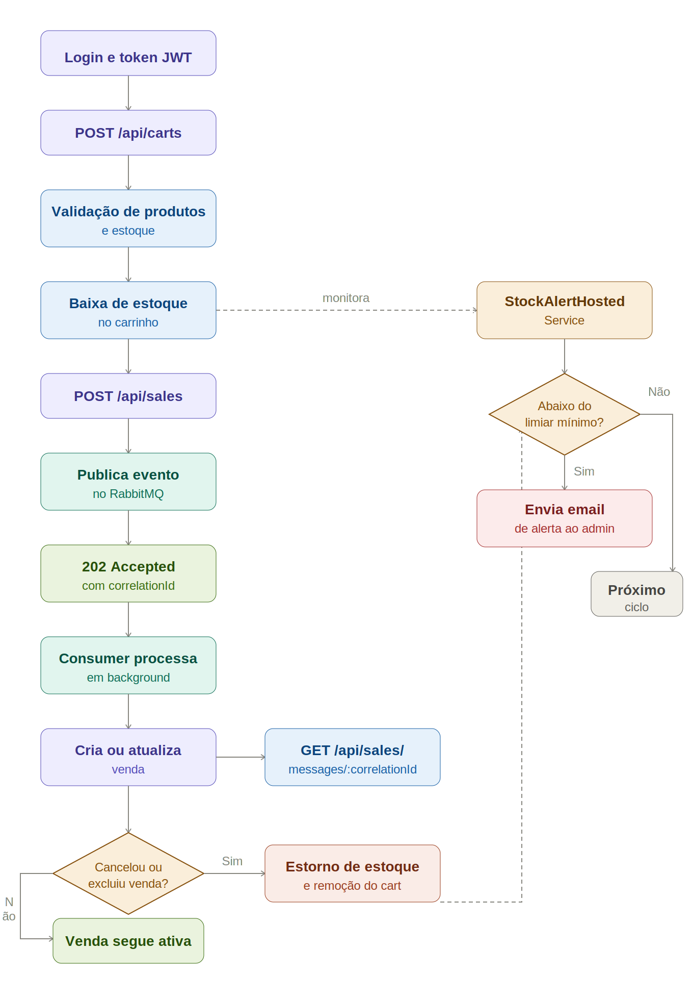

# 🧾 Fluxo Assíncrono de Vendas, Carrinho e Estoque

> Documento complementar ao README principal com foco no fluxo operacional completo de compra: montagem de carrinho, baixa/estorno de estoque, criação e manutenção da venda via RabbitMQ.

[Voltar para o README principal](./README.md)

---

## 🗂️ Índice

- [Visão Geral](#-visão-geral)
- [Topologia RabbitMQ](#-topologia-rabbitmq)
- [Jornada de Compra (Passo a Passo)](#-jornada-de-compra-passo-a-passo)
- [Baixa e Estorno de Estoque](#-baixa-e-estorno-de-estoque)
- [Contrato Assíncrono e Status](#-contrato-assíncrono-e-status)
- [Worker de Alerta de Estoque](#-worker-de-alerta-de-estoque)
- [Diagrama de Fluxo da Compra](#-diagrama-de-fluxo-da-compra)
- [Script para Gerar o Diagrama](#-script-para-gerar-o-diagrama)
- [Como Validar Rapidamente](#-como-validar-rapidamente)

---

## 🎯 Visão Geral

A solução separa claramente a responsabilidade entre **carrinho** e **venda**:

- A **baixa de estoque acontece no carrinho**, no momento de criar/atualizar itens.
- A **venda** é criada/atualizada/cancelada/excluída de forma **assíncrona** via RabbitMQ.
- Em cancelamento/exclusão/troca de carrinho da venda, ocorre **estorno de estoque** e remoção do carrinho antigo quando aplicável.

Esse desenho permite resposta rápida da API (`202 Accepted`) com rastreamento por `correlationId`, mantendo consistência transacional entre venda, carrinho e inventário.

---

## 📨 Topologia RabbitMQ

### Exchange e roteamento

- Exchange principal (`topic`): `devstore.sales.events.v1`
- Routing keys:
  - `sale.created.v1`
  - `sale.modified.v1`
  - `sale.cancelled.v1`
  - `sale.deleted.v1`

### Filas de processamento

- `devstore.sales.created.persist.v1`
- `devstore.sales.modified.persist.v1`
- `devstore.sales.cancelled.persist.v1`
- `devstore.sales.deleted.persist.v1`

### Dead letter

- Exchange: `devstore.sales.dlx.v1`
- Queue: `devstore.sales.dlq.v1`

---

## 🛒 Jornada de Compra (Passo a Passo)

### 1) Autenticação

1. Consumidor autentica em `POST /api/auth/login`.
2. API retorna JWT.
3. Cliente envia `Bearer <token>` nas chamadas protegidas.

### 2) Montagem do carrinho

1. Cliente cria carrinho em `POST /api/carts` com produtos/quantidades.
2. Sistema valida:
   - limite de quantidade agregada por produto;
   - existência de produtos;
   - disponibilidade de estoque.
3. Em sucesso, o estoque do inventário é **debitado imediatamente** e o carrinho é persistido.

### 3) Ajuste do carrinho

1. Cliente ajusta itens em `PUT /api/carts/{id}`.
2. Sistema calcula delta por produto entre estado antigo e novo.
3. Regras de ajuste:
   - `delta > 0`: debita estoque adicional;
   - `delta < 0`: devolve estoque automaticamente;
   - `delta = 0`: não altera inventário.

### 4) Criação da venda (assíncrona)

1. Cliente envia `POST /api/sales` com `cartId`, `customerId`, `branchId` e data.
2. API publica evento no RabbitMQ e responde `202 Accepted` com `correlationId`.
3. Consumer processa mensagem em background:
   - valida customer, branch e cart;
   - garante que o cart ainda não possui venda;
   - monta itens da venda a partir do cart e preço de catálogo;
   - persiste a venda.

### 5) Acompanhamento assíncrono

1. Cliente consulta `GET /api/sales/messages/{correlationId}`.
2. Estados possíveis: `Queued`, `Processing`, `Retrying`, `Succeeded`, `DeadLettered`.

### 6) Atualização, cancelamento e exclusão da venda

- `PUT /api/sales/{id}`: enfileira atualização da venda.
- `POST /api/sales/{id}/cancel`: enfileira cancelamento.
- `DELETE /api/sales/{id}`: enfileira exclusão.

Todos retornam `202 Accepted` com `correlationId`.

---

## 📦 Baixa e Estorno de Estoque

### Quando ocorre baixa

- Na criação do carrinho (`CreateWithInventoryDeductionAsync`).
- No update de carrinho quando a quantidade final aumenta para um produto (`UpdateWithInventoryAdjustmentAsync`).

### Quando ocorre estorno

- Na redução de itens no update do carrinho.
- Na exclusão de carrinho (`DeleteAsync`) quando permitido.
- No cancelamento de venda (`CancelWithCartAndStockReturnAsync`):
  - marca venda como cancelada;
  - desvincula `CartId`;
  - devolve estoque agregado do carrinho;
  - remove o carrinho vinculado.
- Na exclusão de venda (`DeleteWithCartAndStockReturnAsync`):
  - remove venda;
  - devolve estoque agregado do carrinho;
  - remove o carrinho vinculado.
- Na troca de carrinho em update de venda (`ReplaceCartAndPersistAsync`):
  - reaponta para novo cart;
  - estorna estoque do cart antigo;
  - remove cart antigo.

Observação importante: a venda em si nao debita estoque; ela consome um carrinho cujo estoque ja foi reservado.

---

## 📬 Contrato Assíncrono e Status

### Resposta padrão de escrita assíncrona

```json
{
  "success": true,
  "message": "Solicitação ... enfileirada com sucesso",
  "data": {
    "correlationId": "abc123..."
  }
}
```

### Endpoint de status

- `GET /api/sales/messages/{correlationId}`

### Retry com backoff explícito

Configuração em `appsettings`:

```json
"SalesMessaging": {
  "Retry": {
    "MaxRetries": 3,
    "BackoffSeconds": [2, 5, 15]
  }
}
```

Comportamento:

- Falha na tentativa 1 -> espera 2s e republica.
- Falha na tentativa 2 -> espera 5s e republica.
- Falha na tentativa 3 -> espera 15s e republica.
- Excedeu `MaxRetries` -> `nack` sem requeue (DLQ).

---

## 🚨 Worker de Alerta de Estoque

A aplicação possui um serviço em segundo plano, `StockAlertHostedService`, executando continuamente para monitorar o inventário.

Fluxo do worker:

1. Inicia junto com a API.
2. Aguarda 30 segundos apos o start.
3. Em intervalo configuravel (`StockAlert:CheckIntervalMinutes`), consulta produtos com:
   - `MinimumStockAlert > 0` e
   - `AvailableQuantity <= MinimumStockAlert`.
4. Quando encontra itens criticos, envia email consolidado para o administrador.
5. Em erro de envio/execucao, registra log e segue para o proximo ciclo.

Configuracao por ambiente (Docker):

- `StockAlert__MailjetApiKey` / `MAILJET_API_KEY`
- `StockAlert__MailjetSecretKey` / `MAILJET_SECRET_KEY`
- `StockAlert__FromEmail` / `ALERT_EMAIL_FROM`
- `StockAlert__AdminEmail` / `ALERT_EMAIL_TO`
- `StockAlert__CheckIntervalMinutes` / `ALERT_CHECK_INTERVAL_MINUTES`

---

## 🧭 Diagrama de Fluxo da Compra



---

## 🛠️ Script para Gerar o Diagrama

Foi adicionado o script PowerShell:

- `scripts/Generate-SalesFlowDiagram.ps1`

Ele gera:

- `images/diagrams/sales-purchase-flow.mmd`
- `images/diagrams/sales-purchase-flow.svg`
- `images/diagrams/sales-purchase-flow.png`

Execucao:

```powershell
./scripts/Generate-SalesFlowDiagram.ps1
```

Opcionalmente, para definir pasta de saida:

```powershell
./scripts/Generate-SalesFlowDiagram.ps1 -OutputDir "images/diagrams"
```

Requisito: Node.js com `npx` disponivel para executar `@mermaid-js/mermaid-cli`.

---

## ✅ Como Validar Rapidamente

1. Subir stack com RabbitMQ + PostgreSQL + API.
2. Criar carrinho em `POST /api/carts` e observar baixa no inventario.
3. Criar venda em `POST /api/sales` e capturar `correlationId`.
4. Consultar status em `GET /api/sales/messages/{correlationId}` ate `Succeeded`.
5. Cancelar venda (`POST /api/sales/{id}/cancel`) e confirmar estorno no inventario.
6. Verificar logs do worker de estoque e, com limiar configurado, confirmar envio de alerta por email.
